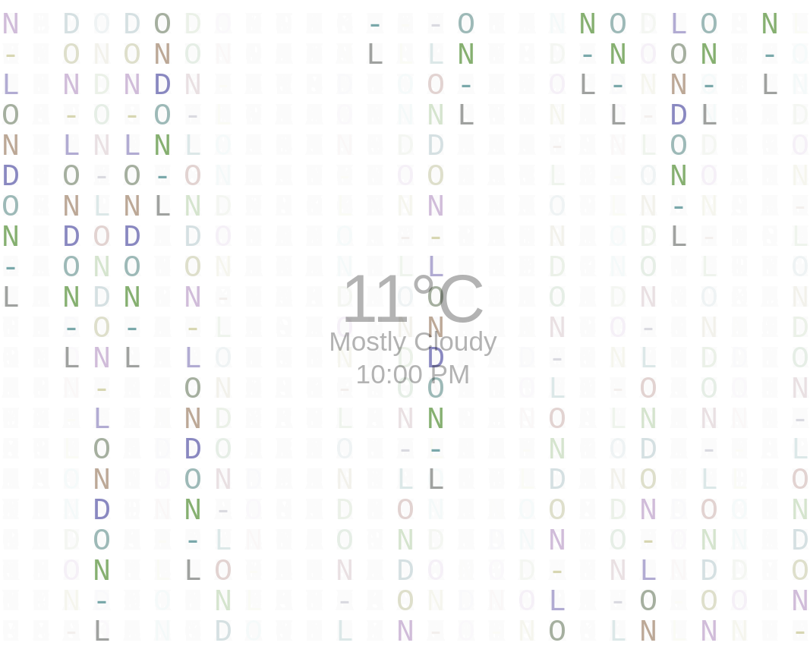

# Yahoo Weather Matrix Screensaver (Vue.js)

Vue.js app that fetches a city from the Yahoo Weather API and displays the name in a matrix style screensaver



## Project setup
```
npm install
```

### Compiles and hot-reloads for development
```
npm run serve
```

### Compiles and minifies for production
```
npm run build
```

Run:  

```http://localhost:8080/```  
  